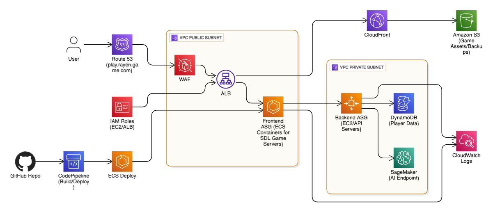

# Simple: SDL Game with optional local AI and Docker

This repository keeps things minimal so you can understand every step later. It shows how to run the original SDL-based C game locally, test a tiny Python AI, and build a simple Docker image for local testing. When you're ready, you can extend this toward AWS.

What you have here (simple):
- `Dockerfile` — Debian-based, installs SDL 1.2 dev packages, builds the C sources into `GAME`, and provides a `HEALTHCHECK` using `./GAME --health`.
- `main.c` — simple entrypoint that supports two small flags:
  - `--health` : exit 0 (used by container health checks)
  - `--ai-test` : runs `ai_model.py` with a sample input and prints the result
- `ai_model.py` — tiny scikit-learn model that trains a DecisionTree if needed and accepts a CLI list like `[1,0,10]` to print a predicted move.
- `buildspec.yml` — minimal example for CodeBuild (local-friendly): builds a Docker image named `my-game:latest`.

---

## Architecture (visual)

The following diagram shows the cloud-ready architecture this project is designed to be ready for (ECS / ALB / DynamoDB / SageMaker etc.). Importantly: you do not need AWS to run the project locally — this image documents the planned cloud deployment.



## README: super-clear quick guide

This section summarizes exactly what to do to build, run, and push the project to GitHub.

1) Verify repository files

- Ensure the `image/` and `text/` folders are present and contain the game assets listed in the repo (sprites, map images, `hero.txt`, `spells.txt`, `enemy1.txt`, `enemy2.txt`).
- Confirm `main.c`, `Header.h` and the C sources (`hero.c`, `enemy.c`, `game.c`, `menu.c`, `battle.c`, `collision.c`, `options.c`) are in the root.

2) Install dependencies (Debian / WSL)

```bash
sudo apt update
sudo apt install -y build-essential gcc make python3 python3-pip libsdl1.2-dev libsdl-image1.2-dev libsdl-ttf2.0-dev libsdl-gfx1.2-dev libsmpeg-dev libsqlite3-dev
pip3 install --user joblib scikit-learn numpy
```

3) Build locally (quick)

```bash
# compile all .c files into GAME (simple, readable command)
cd /path/to/game
gcc *.c -o GAME -g -lm -lSDL -lSDL_image -lSDL_gfx -lSDL_ttf

# quick checks
./GAME --health      # returns immediately (health flag)
./GAME --ai-test     # runs ai_model.py and prints the AI prediction
```

4) Run the game

```bash
# run the interactive game
./GAME
# Use keyboard arrows and Enter to navigate the menu and play.
```

5) Build & run with Docker (local)

```bash
# build the container image
docker build -t my-game:latest .
# run the container interactively
docker run --rm -it my-game:latest
# or run detached for healthchecks
docker run -d --name game_container my-game:latest
# view logs
docker logs -f game_container
```

6) Simple local DB & AI tests

- To test the SQLite placeholder (if present):
```bash
gcc -o database database.c -lsqlite3
./database   # creates game.db and sample data
sqlite3 game.db "select * from Players;"
```

- To test the AI model alone:
```bash
python3 ai_model.py           # prints a sample prediction
python3 ai_model.py '[1,0,10]'  # prints prediction for that vector
```

7) Prepare and push to GitHub (commands)

```bash
git init
git add .
git commit -m "Initial: SDL game + local AI + Docker"
# create a repo on GitHub and then:
git remote add origin git@github.com:<your-user>/<your-repo>.git
git branch -M main
git push -u origin main
```

8) LinkedIn copy (short):

```
Proud to share my SDL C game! Built locally with Docker and a small Python AI, designed to be AWS-ready (ECS + DynamoDB + SageMaker). Repository has clear instructions to run locally — open to feedback and tips. #GameDev #DevOps #AI #AWS
```

9) Troubleshooting tips (most common issues)

- Missing images or fonts => program can crash when IMG_Load/TTF_OpenFont returns NULL. If you see a segfault, verify `image/` and `police/DejaVuSans.ttf` exist.
- SDL linking errors at compile => ensure `libsdl1.2-dev` and related dev packages are installed.
- Docker build errors => check build output to see which apt package is missing; typically adding the dev package listed above resolves this.

10) Next steps (pick one)

- I can add a tiny `deploy.sh` (one-file) that builds the Docker image and runs it with clear comments.
- I can scaffold a tiny Flask backend that wraps SQLite + the AI model with two endpoints (`/player`, `/ai`) — this keeps your C game unchanged and is easy to later move to AWS.
- I can add a simple GitHub Actions workflow that builds the Docker image and runs the `--ai-test` as a CI check.


## Table of contents

- [Architecture (visual)](#architecture-visual)
- [Prerequisites](#prerequisites)
- [Build & run (local)](#build--run-local)
- [Docker (local)](#docker-local)
- [AI and DB quick checks](#ai-and-db-quick-checks)
- [Push to GitHub](#push-to-github)
- [Troubleshooting](#troubleshooting)
- [Next steps (pick one)](#next-steps-pick-one)

## Architecture (visual)

This diagram illustrates the cloud-ready architecture the project is prepared to move toward. You do not need AWS to run locally — the image documents the intended deployment.

## Troubleshooting

- Missing images/fonts: if the program crashes, verify the `image/` folder and `police/DejaVuSans.ttf` exist. Add NULL checks in code to get readable error messages.
- SDL linking errors: ensure `libsdl1.2-dev` and the image/ttf/gfx dev packages are installed.
- Docker build issues: read the container build output; add missing apt packages when prompted.


